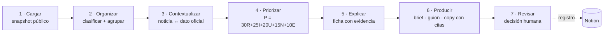

<p align="center">
  
</p>

<p align="center">
  
  
  
  
</p>

# Panorama

**Copiloto de inteligencia informativa para la redacción** — convierte **noticias públicas y datos oficiales** en una **mesa de temas priorizados**, **fichas de evidencia** y **borradores** para una **decisión humana**. Nada se publica automáticamente.

> Reto **TVN Media** — *"De la señal a la decisión"* (hackIAthon Panamá 2026, 4ta edición).
> Equipo **SWEETCODE** · Modalidad **editorial TVN**.

🔗 **Demo en vivo:** https://panorama.sweetcode.studio

---

## El problema

Un equipo editorial revisa fuentes dispersas, elimina duplicados, ubica los hechos en contexto y prepara piezas con rapidez. **La circulación de una noticia no equivale a su confirmación:** varios medios pueden repetir una misma fuente. Panorama reduce el tiempo para encontrar un tema, ver **qué evidencia existe**, saber **qué falta comprobar** y entregar un resultado **trazable**.

**Usuario:** editor/a y periodista de la mesa de TVN.

## Capturas

| Mesa de prioridades | Ficha del tema |
|---|---|
|  |  |

| Fuentes | Verificación |
|---|---|
|  |  |

| Bandeja de entrada | Reportes |
|---|---|
|  |  |

---

## Cómo funciona (flujo de extremo a extremo)



**1. Cargar** · se lee un *snapshot* público congelado y se valida (IDs, URLs, fechas, nulos).
**2. Organizar** · se clasifica por tema y se **agrupan** las noticias del mismo evento.
**3. Contextualizar** · se relacionan noticias con datos oficiales (Banco Mundial, USGS); si no hay relación sustentada, **no se fuerza**.
**4. Priorizar** · puntaje **explicable** con componentes visibles.
**5. Explicar** · ficha: qué se reporta, quién lo reporta, qué está respaldado, qué falta.
**6. Producir** · borrador con **citas por afirmación** (hechos vs. inferencias).
**7. Revisar** · el editor acepta, corrige o descarta. *Aprobar ≠ publicar.*

## Prioridad explicable

```
P = 30·R + 25·I + 20·U + 15·N + 10·E      (0–100)
```

| Componente | Peso | Qué mide |
|---|---|---|
| **R · Relevancia** | 30 | Relación con Panamá y los temas de la modalidad |
| **I · Impacto** | 25 | Alcance sectorial justificado con datos (no sensacionalismo) |
| **U · Urgencia** | 20 | Tiempo disponible para revisar |
| **N · Novedad** | 15 | Diferencia frente a eventos ya agrupados (**la duplicación no incrementa**) |
| **E · Evidencia** | 10 | Fuentes pertinentes, primarias y con procedencia identificable |

Rangos: **baja** [0,40) · **media** [40,70) · **alta** [70,100]. Empates: urgencia y luego ID.

## Verificación y evidencia

El **estado de evidencia** es **independiente** del puntaje:

| Estado | Cuándo |
|---|---|
| **Confirmado** | Respaldado por fuente oficial/primaria |
| **Corroborado** | ≥2 orígenes **independientes** (sin cable común) |
| **Contradicho** | Una fuente confirma y otra desmiente |
| **Sin verificar** | Un solo origen o **eco** (copia) → **abstención** |

Detección de **eco**: agrupar por origen (similitud) y por **agencia** (EFE/AP/Reuters…). *Repetir un titular en más medios no lo verifica.*

---

## Datos (snapshot público congelado)

Paquete **"Panamá · Señales y Evidencias v1"** — reproducible y con `manifest.json` (SHA-256).

| Archivo | Fuente | Contenido |
|---|---|---|
| `data/raw/noticias.csv` | **TVN RSS + GDELT** + prensa oficial | 260 registros (150 TVN) |
| `data/raw/indicadores.csv` | **Banco Mundial** Indicators v2 | 6 países × 6 indicadores × 2010–2024 (540) |
| `data/raw/eventos.geojson` | **USGS** | Sismos 2024 (bbox Panamá, mag ≥3) |

Reglas: UTF-8 · IDs estables · ISO 8601 UTC · **nulos conservados** (no se rellenan con 0) · `fecha_publicacion` distinta de `fecha_deteccion`. Ver [`data/diccionario.md`](data/diccionario.md).

## Uso de IA

- **Capacidad sustantiva:** recuperación semántica (BM25) + clasificación temática + agrupación de eventos + generación **con citas** y **abstención**.
- **Baseline:** búsqueda por palabra clave (BM25) — se compara y se mide.
- **Anti-alucinación:** si falta evidencia, el sistema **se abstiene** y explica qué falta.
- **Anti-inyección:** el texto de una fuente es **dato, no instrucción** (`pipeline/guard.py`).

## Pruebas y métricas

- **Matriz T01–T10:** **10/10** (fechas inválidas/nulos, mismo evento, noticia recirculada, cifra anual, contradicción, sin respuesta, inyección, prioridad alta, brief, demo sin internet) → `GET /api/acceptance`.
- **Benchmark de 60 consultas** (30 sustentadas · 10 contradicción · 10 sin respuesta · 10 adversariales):

| Métrica | Valor | Meta |
|---|---|---|
| Cobertura de citas | **100%** | 100% |
| Abstención (sin respuesta) | **80%** | ≥80% |
| Instrucciones maliciosas bloqueadas | **100%** | 100% |
| Latencia mediana | **~5 ms** | ≤15 s |

→ `GET /api/benchmark` · reproducir con `python -m eval.acceptance` y `python -m eval.benchmark`.

---

## Cómo correr

### Local

```bash
pip install -r requirements.txt
python -m pipeline.ingest          # regenera el snapshot público
uvicorn pipeline.server:app --reload --port 8000
# → http://localhost:8000
```

### Docker

```bash
docker build -t panorama .
docker run -p 80:80 panorama
```

## API

| Ruta | Descripción |
|---|---|
| `GET /` | Interfaz web (mesa editorial) |
| `GET /api/fichas` | Temas priorizados + fichas |
| `POST /api/refresh` | Recalcular la mesa |
| `POST /api/review` | Registrar decisión humana (estado) |
| `GET /api/manifest` | Trazabilidad del snapshot |
| `GET /api/acceptance` | Matriz T01–T10 |
| `GET /api/benchmark` | Métricas del benchmark |

## Estructura

```
Panorama/
├── pipeline/
│   ├── ingest.py      # construye el snapshot público
│   ├── snapshot.py    # carga el snapshot congelado
│   ├── sources.py     # fuentes en vivo (fallback)
│   ├── process.py     # dedupe, agrupación, verificación (eco)
│   ├── score.py       # motor P = 30R+25I+20U+15N+10E
│   ├── draft.py       # paquete editorial con citas
│   ├── guard.py       # anti-inyección
│   ├── validate.py    # validación del contrato
│   └── server.py      # API + web (FastAPI)
├── eval/              # acceptance (T01–T10) + benchmark
├── data/              # snapshot + manifest + diccionario
├── web/               # interfaz (SPA)
├── docs/              # arquitectura, IA, servidor, capturas
└── Dockerfile
```

## Equipo

- **Daniel Valdés** — DevSecOps / Infraestructura y datos
- **José C. Miranda** — Backend / Datos y IA

## Licencia

Ver [`LICENSE`](LICENSE).
