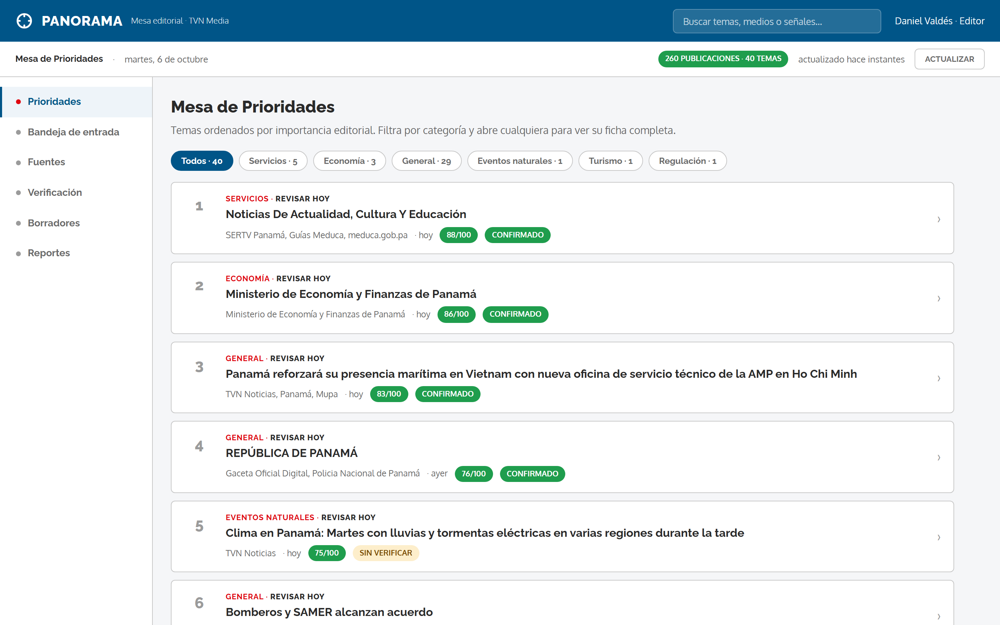
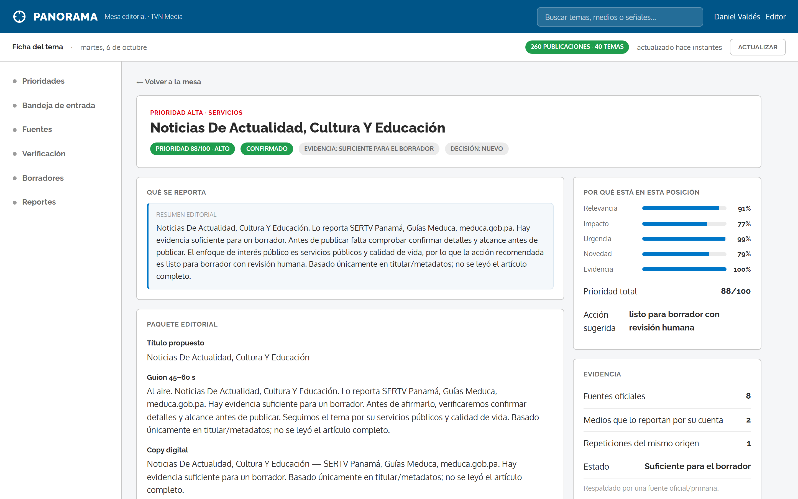
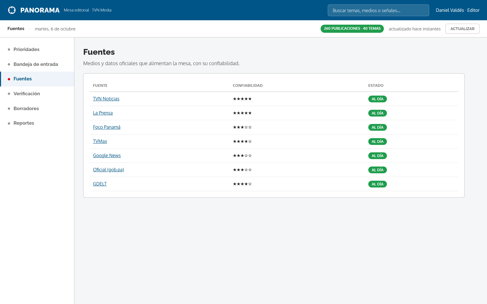
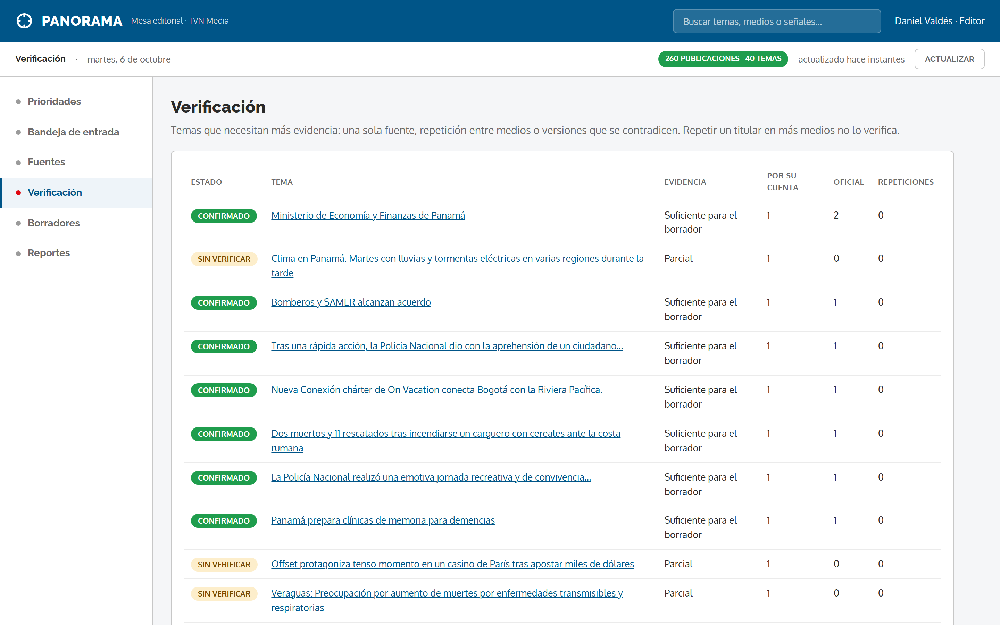

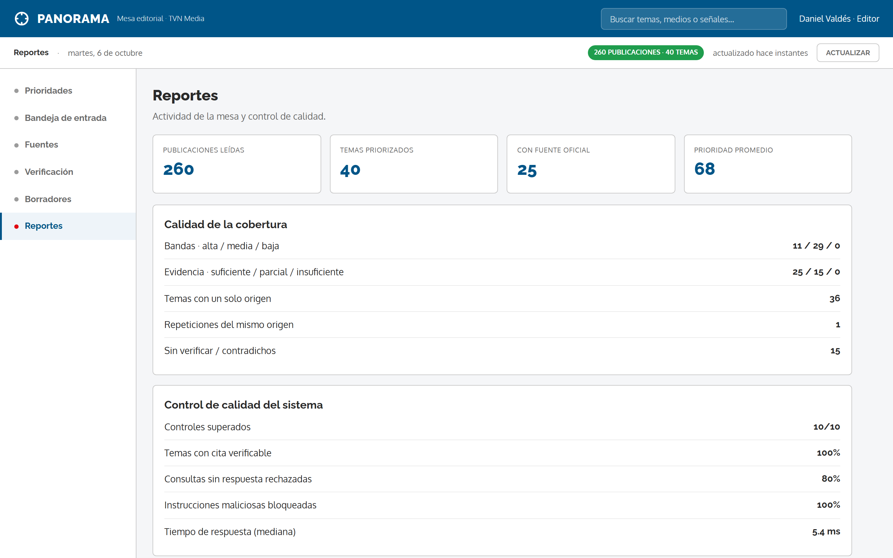

<p align="center">
  
</p>

<h1 align="center">Panorama</h1>

<p align="center">
  <b>Copiloto de inteligencia informativa para la redacción</b><br/>
  Convierte noticias públicas y datos oficiales en una mesa de temas priorizados, fichas de evidencia y borradores — para una decisión humana.
</p>

<p align="center">
  
  
  
  
  
</p>

<p align="center">
  <a href="https://panorama.sweetcode.studio"><b>Demo en vivo</b></a> ·
  <a href="docs/ARQUITECTURA.md">Arquitectura</a> ·
  <a href="docs/screenshots">Capturas</a>
</p>

---

## ¿Qué es?

**Reto TVN Media — "De la señal a la decisión" (hackIAthon Panamá 2026).** Panorama toma **noticias públicas** (TVN, GDELT) y **datos oficiales** (Banco Mundial, USGS), las **agrupa y prioriza** con un puntaje explicable, y entrega cada tema en una **ficha con evidencia**: qué se reporta, quién lo reporta, qué está respaldado y qué falta comprobar.

> **Diseño clave:** la circulación de una noticia **no equivale a su confirmación**. Panorama distingue **repetición** (eco) de **corroboración independiente**, se **abstiene** cuando no hay evidencia y **nunca publica**: la decisión es del editor.

## Cómo funciona


## Capturas

**1. Mesa de prioridades** — los temas ordenados por importancia, con filtros por categoría, tiempo sugerido (Revisar hoy / Esta semana) y fecha. Un clic abre la ficha.



**2. Ficha del tema** — resumen editorial, paquete editorial (guion y copy), afirmaciones con citas, y el desglose de por qué está en esa posición (Relevancia, Impacto, Urgencia, Novedad, Evidencia).



**3. Fuentes** — medios y datos oficiales que alimentan la mesa, con su confiabilidad.



**4. Verificación** — temas que necesitan más evidencia: una sola fuente, repetición entre medios o versiones contradictorias.



**5. Bandeja de entrada** — publicaciones leídas de las fuentes, sin duplicados.



**6. Reportes** — actividad de la mesa y control de calidad del sistema.



## Arquitectura


## Prioridad explicable

```
P = 30·R + 25·I + 20·U + 15·N + 10·E      (0–100)
```

| Componente | Peso | Qué mide |
|---|---|---|
| **R · Relevancia** | 30 | Relación con Panamá y los temas de la modalidad |
| **I · Impacto** | 25 | Alcance sectorial justificado con datos (no sensacionalismo) |
| **U · Urgencia** | 20 | Tiempo disponible para revisar |
| **N · Novedad** | 15 | Diferencia frente a eventos ya agrupados (**la duplicación no incrementa**) |
| **E · Evidencia** | 10 | Fuentes pertinentes, primarias y con procedencia identificable |

Rangos: **baja** [0,40) · **media** [40,70) · **alta** [70,100]. El **estado de evidencia** es **independiente** del puntaje.

## Verificación y evidencia

| Estado | Cuándo |
|---|---|
| **Confirmado** | Respaldado por fuente oficial/primaria |
| **Corroborado** | ≥2 orígenes **independientes** (sin cable común) |
| **Contradicho** | Una fuente confirma y otra desmiente |
| **Sin verificar** | Un solo origen o **repetición** → **abstención** |

## Datos (snapshot público congelado)

Paquete **"Panamá · Señales y Evidencias v1"**, reproducible y con `manifest.json` (SHA-256).

| Archivo | Fuente | Contenido |
|---|---|---|
| `data/raw/noticias.csv` | TVN RSS + GDELT + prensa oficial | 260 registros (150 TVN) |
| `data/raw/indicadores.csv` | Banco Mundial Indicators v2 | 6 países × 6 indicadores × 2010–2024 (540) |
| `data/raw/eventos.geojson` | USGS | Sismos 2024 (bbox Panamá, mag ≥3) |

Reglas: UTF-8 · IDs estables · ISO 8601 UTC · **nulos conservados** (no se rellenan con 0). Ver [`data/diccionario.md`](data/diccionario.md).

## Stack

| Capa | Tecnología |
|------|------------|
| API | FastAPI + Uvicorn |
| Núcleo | Python — BM25, RapidFuzz (dedupe/agrupación) |
| Datos | CSV / GeoJSON (snapshot congelado) |
| Interfaz | HTML + CSS + JS (sin frameworks) |
| Control humano | Estados de revisión + Notion |
| Deploy | Docker + Dokku + Cloudflare Tunnel |

## API

| Método | Ruta | Descripción |
|--------|------|-------------|
| `GET` | `/api/fichas` | Temas priorizados + fichas |
| `POST` | `/api/refresh` | Recalcular la mesa |
| `POST` | `/api/review` | Registrar la decisión del editor |
| `GET` | `/api/manifest` | Trazabilidad del snapshot |
| `GET` | `/api/acceptance` | Matriz de pruebas T01–T10 |
| `GET` | `/api/benchmark` | Métricas del benchmark |
| `GET` | `/health` | Estado del servicio |

<details>
<summary>Ejemplo de decisión editorial</summary>

```bash
curl -X POST https://panorama.sweetcode.studio/api/review \
  -H "Content-Type: application/json" \
  -d '{"id":"<id_tema>","state":"en revisión","reviewer":"Editor"}'
```
</details>

## Pruebas y métricas

- **Matriz T01–T10:** **10/10** → `GET /api/acceptance`.
- **Benchmark de 60 consultas** (30 sustentadas · 10 contradicción · 10 sin respuesta · 10 adversariales):

| Métrica | Valor | Meta |
|---|---|---|
| Cobertura de citas | **100%** | 100% |
| Abstención (sin respuesta) | **80%** | ≥80% |
| Instrucciones maliciosas bloqueadas | **100%** | 100% |
| Latencia mediana | **~5 ms** | ≤15 s |

## Ejecución local

```bash
pip install -r requirements.txt
python -m pipeline.ingest          # regenera el snapshot público
uvicorn pipeline.server:app --reload --port 8000   # http://localhost:8000
```

<details>
<summary>Docker</summary>

```bash
docker build -t panorama .
docker run -p 80:80 panorama
```
</details>

## Estructura

```
pipeline/     ingesta · snapshot · proceso · prioridad · borrador · guard · API
eval/         pruebas de aceptación (T01–T10) y benchmark
data/         snapshot congelado + manifest + diccionario
web/          interfaz (SPA)
docs/         arquitectura · capturas · diagramas
```

## Equipo

<table>
  <tr>
    <td align="center" width="50%">
      <br/>
      <b>Daniel Valdés</b><br/>
      <sub>DevSecOps · Infraestructura y datos</sub><br/><br/>
      <a href="https://www.linkedin.com/in/daniel--valdes">LinkedIn</a> ·
      <a href="https://github.com/danielvaldess">GitHub</a>
    </td>
    <td align="center" width="50%">
      <br/>
      <b>José C. Miranda</b><br/>
      <sub>Backend · Datos e IA</sub><br/><br/>
      <a href="https://www.linkedin.com/in/jos-mi-cast-300mm1500/">LinkedIn</a> ·
      <a href="https://github.com/josecmirandac15">GitHub</a>
    </td>
  </tr>
</table>

## Entregables hackIAthon

- **Repositorio:** este repo.
- **Prototipo en ejecución:** https://panorama.sweetcode.studio
- **Trazabilidad y decisiones:** Notion (espacio del equipo).

## Licencia

Ver [`LICENSE`](LICENSE).
