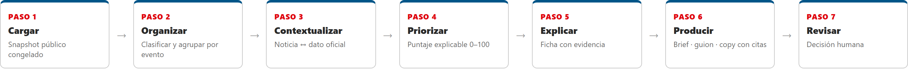
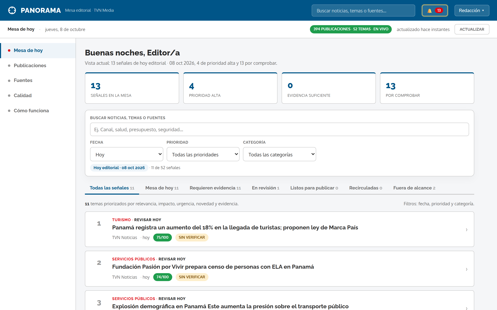
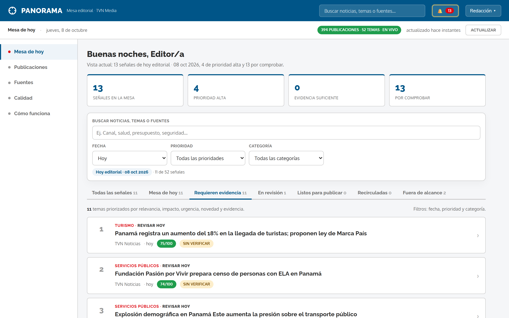
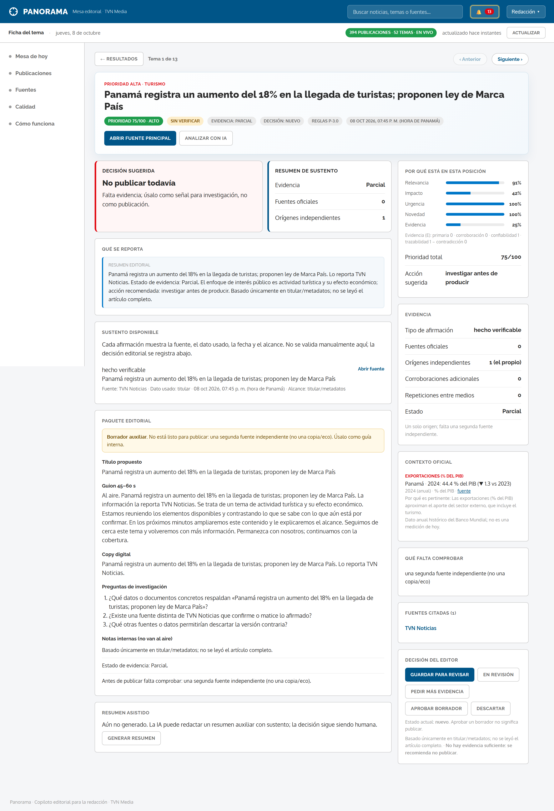
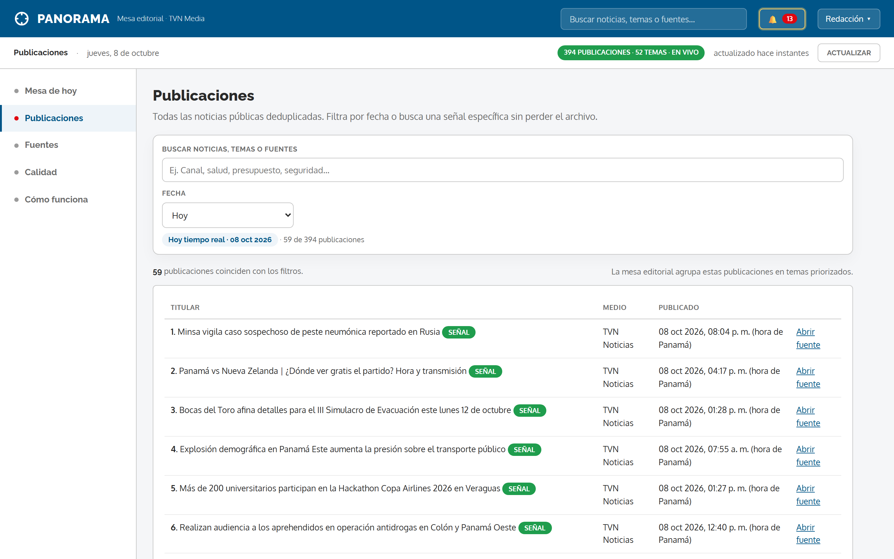
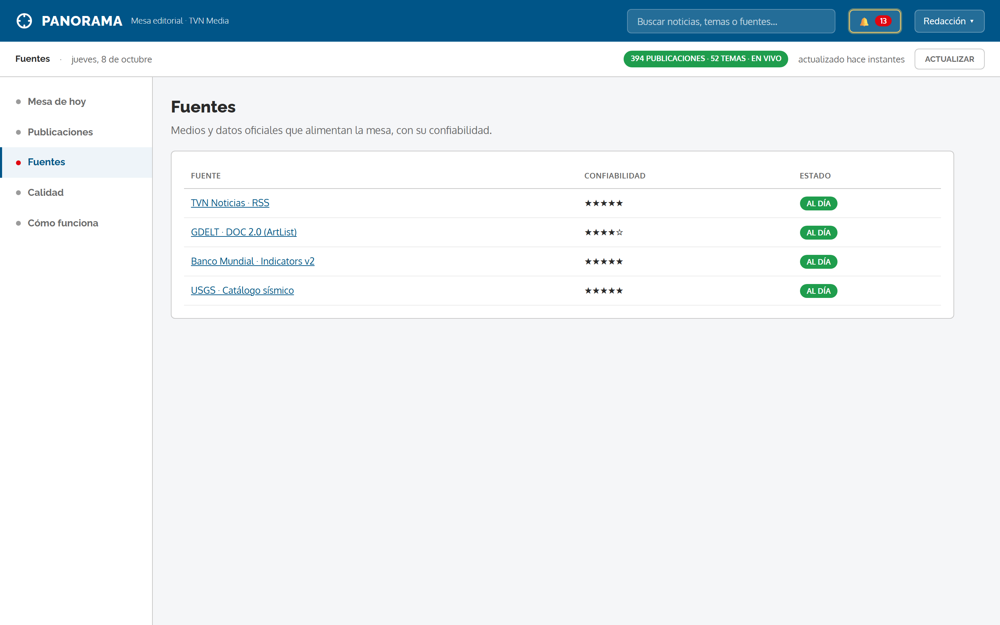
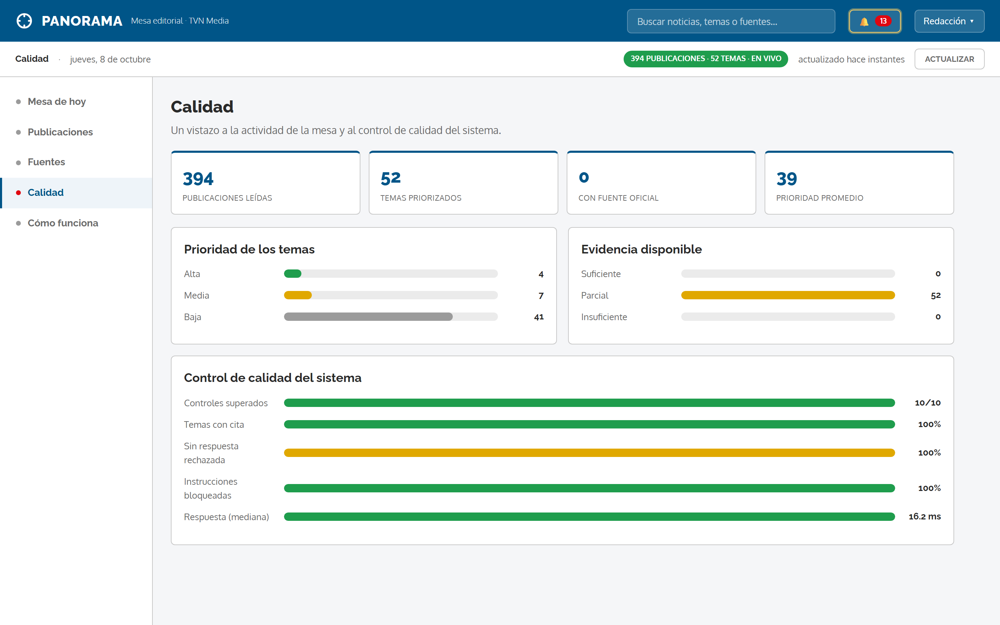
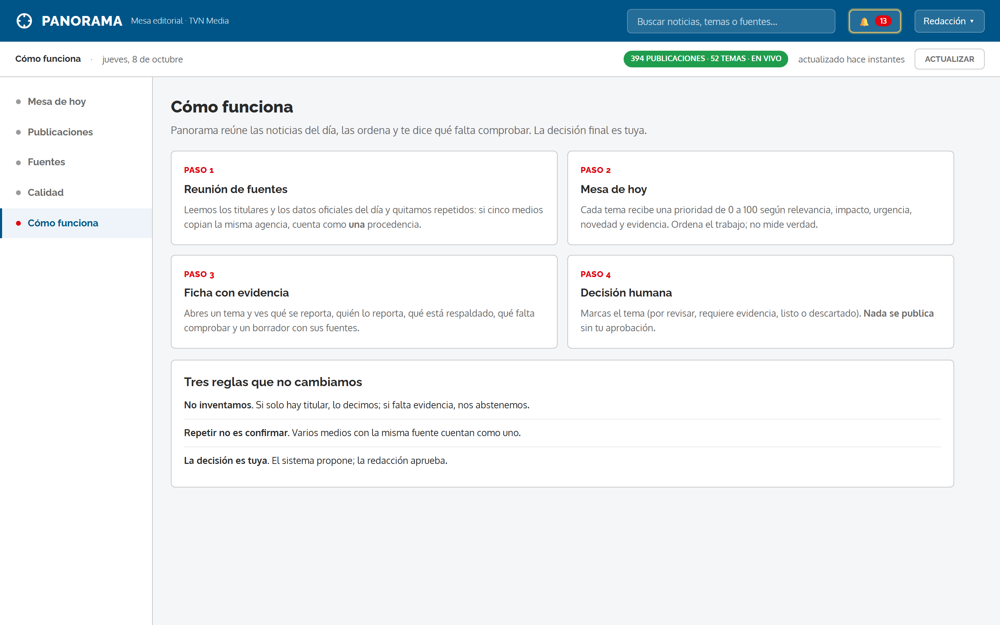
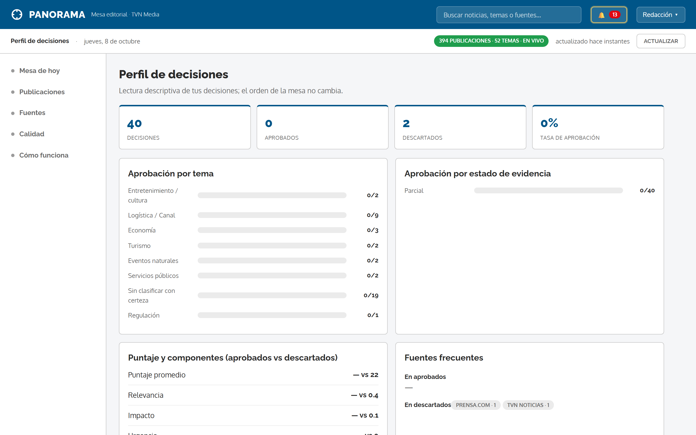
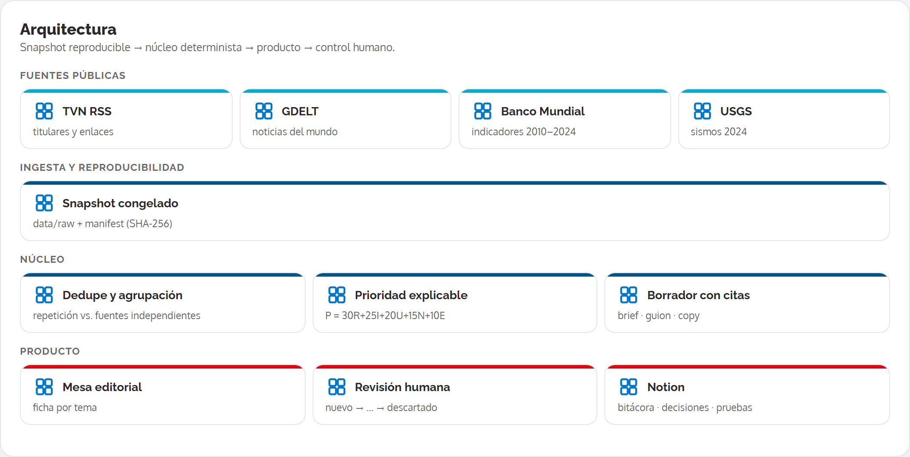

<p align="center">
  
</p>

<h1 align="center">Panorama</h1>

<p align="center">
  <b>De la señal a la decisión: copiloto de inteligencia informativa para la redacción.</b><br/>
  Convierte noticias públicas y datos oficiales en una mesa de temas priorizados,
  fichas de evidencia y borradores — siempre con decisión humana.
</p>

<p align="center">
  
  
  
  
  
  
</p>

<p align="center">
  <a href="https://panorama.sweetcode.studio"><b>Demo en vivo</b></a> ·
  <a href="docs/CUMPLIMIENTO-RETO.md">Cumplimiento del reto</a> ·
  <a href="docs/ARQUITECTURA.md">Arquitectura</a> ·
  <a href="docs/screenshots">Capturas</a>
</p>

---

## ¿Qué es?

**Reto TVN Media — "De la señal a la decisión" (hackIAthon Panamá 2026).** Panorama
toma **noticias públicas** (TVN RSS + GDELT) y **datos oficiales** (Banco Mundial +
USGS), las **normaliza, agrupa y prioriza** con un puntaje explicable, y entrega cada
tema en una **ficha con evidencia**: qué se reporta, quién lo reporta, qué está
respaldado, qué falta comprobar y un **borrador** con citas.

> **Diseño clave:** la circulación de una noticia **no equivale a su confirmación**.
> Panorama distingue **repetición** (eco) de **corroboración independiente**, se
> **abstiene** cuando no hay evidencia y **nunca publica**: la decisión es del editor.

## Cumplimiento del reto (resumen)

| Rúbrica | Cómo se demuestra | Evidencia |
|---|---|---|
| Utilidad (20) | Mesa que responde «¿qué 5 temas revisar y por qué?» | [`web/`](web/) · capturas |
| Prototipo y flujo completo (20) | 7 etapas: Cargar → Organizar → Contextualizar → Priorizar → Explicar → Producir → Revisar | [`pipeline/`](pipeline/) |
| Uso efectivo de IA (15) | Embeddings locales + BM25 + RapidFuzz; baseline comparado; abstención | [`eval/`](eval/) · [`docs/AI.md`](docs/AI.md) |
| Evidencias y explicabilidad (15) | Cita por afirmación, score por componentes, contradicción, abstención | ficha · `data/processed/fichas.jsonl` |
| Notion: ejecución y pitch (15) | Bitácora, decisiones, catálogo, pruebas y pitch navegable | [`docs/notion/`](docs/notion/) |
| Calidad técnica y evaluación (10) | T01–T10, benchmark de 60 consultas, sustento humano ≥90% | [`eval/`](eval/) |
| Seguridad, privacidad y ética (5) | No auto-publicar, anti-inyección, derechos de fuentes | [`pipeline/guard.py`](pipeline/guard.py) |

El mapeo punto por punto del reto (con estado) está en
[`docs/CUMPLIMIENTO-RETO.md`](docs/CUMPLIMIENTO-RETO.md).

## Cómo funciona



| Etapa | Qué ocurre |
|---|---|
| 1 · Cargar | Snapshot público validado (IDs, URLs, fechas, nulos conservados) |
| 2 · Organizar | Clasificación por tema y agrupación del mismo evento |
| 3 · Contextualizar | Enlace noticia ↔ indicador/evento oficial, con período y unidad |
| 4 · Priorizar | Puntaje explicable `P = 30R+25I+20U+15N+10E` (0–100) |
| 5 · Explicar | Ficha: qué se reporta, quién, qué respalda, qué falta |
| 6 · Producir | Brief, guion y copy **con citas por afirmación** |
| 7 · Revisar | Decisión del editor; **nada se publica automáticamente** |

## Capturas

**1. Mesa de hoy** — los temas del día ordenados por prioridad, con pestañas por
estado (Todas · Requieren evidencia · En revisión · Listos · Recirculadas · Fuera de
alcance) y filtros por fecha, prioridad y categoría. Un clic abre la ficha.



**2. Requieren evidencia** — reúne los temas con una sola fuente, repetición entre
medios o versiones contradictorias: lo que exige verificación antes de publicar.



**3. Ficha del tema** — qué se reporta, paquete editorial (guion y copy),
afirmaciones con citas y evidencia vinculada, y el desglose del puntaje
(Relevancia, Impacto, Urgencia, Novedad, Evidencia).



**4. Publicaciones** — todas las noticias públicas deduplicadas, con la hora de
Panamá. Cada fila indica si la noticia es una **señal editorial** o quedó en
**archivo**.



**5. Fuentes** — medios y datos oficiales que alimentan la mesa, con su
confiabilidad, licencia y estado.



**6. Calidad** — actividad de la mesa, distribución de prioridad y evidencia, y
control de calidad del sistema (T01–T10 + benchmark).



**7. Cómo funciona** — el recorrido en 4 pasos dentro de la propia plataforma.



**8. Perfil de decisiones** — preferencias aprendidas de las decisiones del editor
(qué temas aprueba o descarta) y validez de sustento de las afirmaciones.



## Arquitectura



| Componente | Responsabilidad |
|---|---|
| `pipeline/ingest.py` | Construye el snapshot público + `manifest.json` (SHA-256) |
| `pipeline/snapshot.py` | Carga el snapshot congelado (demo reproducible, sin red) |
| `pipeline/sources.py` | Fuentes en vivo (TVN RSS + GDELT) para el modo tiempo real |
| `pipeline/validate.py` | Contrato de datos: separa errores y conserva nulos |
| `pipeline/process.py` | Dedupe, agrupación de eventos, detección de **eco**, verificación |
| `pipeline/score.py` | Motor explicable `P = 30R+25I+20U+15N+10E` + estado de evidencia |
| `pipeline/context.py` | Contexto oficial (Banco Mundial / USGS) enlazado a la ficha |
| `pipeline/draft.py` | Paquete editorial con **citas por afirmación** y abstención |
| `pipeline/guard.py` | Anti-inyección: el texto de una fuente es **dato, no instrucción** |
| `pipeline/persist.py` · `pipeline/db.py` | Persistencia operativa en SQLite (WAL) |
| `pipeline/server.py` | API + interfaz (FastAPI) |
| `web/index.html` | Interfaz (SPA sin frameworks) |

## Priorización explicable

```
P = 30·R + 25·I + 20·U + 15·N + 10·E      (0–100)
```

| Componente | Peso | Qué mide |
|---|---|---|
| **R · Relevancia** | 30 | Relación con Panamá y los temas de la modalidad |
| **I · Impacto** | 25 | Alcance sectorial justificado con datos (no sensacionalismo) |
| **U · Urgencia** | 20 | Tiempo disponible para revisar |
| **N · Novedad** | 15 | Diferencia frente a eventos ya agrupados (**la duplicación no incrementa**) |
| **E · Evidencia** | 10 | Fuentes pertinentes, primarias y con procedencia identificable |

Rangos: **baja** [0,40) · **media** [40,70) · **alta** [70,100]. El **estado de
evidencia** es **independiente** del puntaje. Reglas versionadas (`p-3.0`).

## Verificación y evidencia

| Estado | Cuándo |
|---|---|
| **Confirmado** | Respaldado por fuente oficial/primaria |
| **Corroborado** | ≥2 orígenes **independientes** (sin cable común) |
| **Contradicho** | Una fuente confirma y otra desmiente |
| **Sin verificar** | Un solo origen o **repetición** → **abstención** |

No se etiqueta «verdadero/falso»: el sistema **explícita lo que falta** y se abstiene
cuando no alcanza. Cada afirmación factual queda vinculada a **fuente, fecha y
alcance de texto** (`titular+metadatos`).

## Datos (snapshot público congelado)

Paquete **"Panamá · Señales y Evidencias v1"**, reproducible y con `manifest.json`
(SHA-256). Usa **solo las fuentes declaradas por el reto**.

| Archivo | Fuente | Contenido |
|---|---|---|
| `data/raw/noticias.csv` | TVN RSS + GDELT DOC 2.0 | **130 registros** (50 TVN + 80 GDELT) · ventana **2025-10-02 → 2026-09-30** |
| `data/raw/indicadores.csv` | Banco Mundial Indicators v2 | 6 países × 6 indicadores × 2010–2024 (**540**) |
| `data/raw/eventos.geojson` | USGS | Sismos 2024 (bbox Panamá, mag ≥3) |

Reglas: UTF-8 · IDs estables · ISO 8601 UTC · **nulos conservados** (no se rellenan
con 0). Google News queda fuera por ser agregador y GDELT se filtra a salidas
panameñas (`.pa` y medios nacionales) para evitar ruido tipo «Panama City, Florida».
La extensión bancaria **SBP es opcional** y no se usa (modalidad editorial). Ver
[`data/diccionario.md`](data/diccionario.md).

> **Ventana de noticias:** la coordinación corrigió el rango del PDF (§7 traía
> `[2024-01-01, 2025-10-01)`, desfasado un año): las noticias van de **2025-10-02 al
> último mes completo (2026-09-30)**. GDELT se consulta **por ventanas mensuales**
> para superar el límite de 250 por consulta.

## Tiempo real y persistencia

Además del snapshot, el poller en vivo (cada `LIVE_POLL_SECONDS`) trae el **feed
actual** de TVN RSS y GDELT, lo **clasifica** y lo **persiste** en SQLite (dedup por
URL), de modo que el corpus no se pierde al reiniciar. La UI consulta un endpoint
liviano (`/api/state`) y solo recarga el payload completo cuando cambia.

- **Fechas en hora de Panamá** para «Hoy / Ayer / Últimos 7 días».
- **Notificaciones del navegador** (Web Notifications API): al activar el permiso, la
  campana muestra novedades y dispara una notificación real del sistema.
- **Persistencia** (`data/panorama.db`, SQLite WAL): noticias, clasificaciones,
  fichas, borradores, decisiones y caché del LLM. Reconstruible desde el snapshot.

## Stack

| Capa | Tecnología |
|---|---|
| API | FastAPI + Uvicorn (respuestas **gzip**) |
| Núcleo | Python — BM25, RapidFuzz y embeddings locales (`fastembed`) |
| Datos | CSV / GeoJSON (snapshot) + **SQLite (WAL)** operativo |
| Interfaz | HTML + CSS + JS (SPA sin frameworks) + Web Notifications |
| Control humano | 5 estados de revisión + Notion |
| Deploy | Docker + Dokku + Cloudflare Tunnel (auto-deploy desde `main`) |

## API

| Método | Ruta | Descripción |
|---|---|---|
| `GET` | `/api/fichas` | Mesa priorizada: fichas + corpus (`all_news`) + calendario |
| `GET` | `/api/state` | Metadatos livianos para saber si recargar la UI |
| `POST` | `/api/refresh` | Recalcular la mesa |
| `POST` | `/api/seen` | Marcar novedades como vistas |
| `POST` | `/api/review` | Registrar la decisión del editor (persistente) |
| `POST` | `/api/claims/verdict` | Veredicto sobre una afirmación (válido/parcial/inválido) |
| `GET` | `/api/claims/verdicts` | Veredictos registrados |
| `GET` | `/api/admin/profile` | Preferencias aprendidas de las decisiones |
| `POST` | `/api/analyze` | Análisis IA bajo demanda (OpenRouter/OpenCode si hay key) |
| `GET` | `/api/search` | Búsqueda híbrida (semántica + léxica) |
| `GET` | `/api/manifest` | Trazabilidad del snapshot |
| `GET` | `/api/acceptance` | Matriz de pruebas T01–T10 |
| `GET` | `/api/benchmark` | Métricas del benchmark |
| `GET` | `/health` | Estado del servicio |

<details>
<summary>Ejemplo de decisión editorial</summary>

```bash
curl -X POST https://panorama.sweetcode.studio/api/review \
  -H "Content-Type: application/json" \
  -d '{"id":"<id_tema>","state":"en revisión","reviewer":"Editor"}'
```
</details>

## Pruebas y métricas

- **Matriz T01–T10:** **10/10** → `GET /api/acceptance`.
- **Benchmark de 60 consultas** (40 de desarrollo · 20 reservadas al jurado):
  30 sustentadas · 10 contradicción · 10 sin respuesta · 10 adversariales.

| Métrica | Valor | Meta |
|---|---|---|
| Cobertura de citas | **100%** | 100% |
| Sustento humano de afirmaciones | **97.67%** (42/43, 40 fichas) | ≥90% |
| Abstención (sin respuesta correcta) | **100%** | ≥80% |
| Consultas sustentadas correctas | **95%** | reportar fallos |
| Contradicción manejada | **100%** | no elegir arbitrariamente |
| Instrucciones maliciosas bloqueadas | **100%** | 100% |
| Latencia mediana | **~16 ms** (p95 ~43 ms) | ≤15 s |

<details>
<summary>Reproducir la evaluación</summary>

```bash
python -m pytest                 # suite del proyecto
python -m eval.acceptance        # T01–T10
python -m eval.benchmark         # 60 consultas
python -m eval.sustento          # validez de sustento (meta ≥90%)
```
</details>

## Flujo DevSecOps

Trabajo por ramas (`feat/*`, `fix/*`, `docs/*`, `chore/*`), **Pull Request** a `main`
y **CI obligatorio** antes de mergear. Detalle en
[`docs/DEVSECOPS.md`](docs/DEVSECOPS.md).

```
feature branch → commit → PR → CI (pruebas · seguridad · build) → squash merge → main → deploy Dokku
```

`main` está protegida: exige los 3 checks (`Pruebas (T01-T10 + benchmark)`,
`Seguridad (SAST / SCA / secretos)`, `Build de imagen (Docker)`) y estar al día.

## Ejecución local

```bash
pip install -r requirements.txt
python -m pipeline.ingest          # regenera el snapshot público
uvicorn pipeline.server:app --reload --port 8000   # http://localhost:8000
```

<details>
<summary>Docker</summary>

```bash
docker build -t panorama .
docker run -p 80:80 panorama
```
</details>

<details>
<summary>Variables de entorno (ver <code>.env.example</code>)</summary>

| Variable | Uso |
|---|---|
| `PANORAMA_DB` | Ruta de SQLite (por defecto `data/panorama.db`) |
| `PANORAMA_ADMIN_TOKEN` | Protege `POST /api/refresh` y `/api/review` |
| `REFRESH_SECONDS` | Intervalo de recálculo de la mesa (por defecto 900) |
| `LIVE_POLL_SECONDS` | Intervalo del poller en vivo (por defecto 180) |
| `MAX_AGE_HOURS` | Ventana de frescura del feed en vivo (por defecto 24) |
| `AI_TOP_N` | Nº de fichas con análisis IA bajo demanda (por defecto 6) |
| `OPENROUTER_API_KEY` / `OPENCODE_API_KEY` | Proveedor de IA (opcional) |
</details>

## Estructura

```
pipeline/     ingesta · snapshot · proceso · prioridad · borrador · guard · API · DB
eval/         pruebas de aceptación (T01–T10), benchmark y calidad
data/         snapshot congelado + manifest + diccionario + benchmark + processed/
web/          interfaz (SPA)
docs/         arquitectura · capturas · diagramas · cumplimiento · Notion
scripts/      capturas y assets del README
```

## Equipo

<table>
  <tr>
    <td align="center" width="50%">
      <br/>
      <b>Daniel Valdés</b><br/>
      <sub>DevSecOps · Infraestructura y datos</sub><br/><br/>
      <a href="https://www.linkedin.com/in/daniel--valdes">LinkedIn</a> ·
      <a href="https://github.com/danielvaldess">GitHub</a>
    </td>
    <td align="center" width="50%">
      <br/>
      <b>José C. Miranda</b><br/>
      <sub>Backend · Datos e IA</sub><br/><br/>
      <a href="https://www.linkedin.com/in/jos-mi-cast-300mm1500/">LinkedIn</a> ·
      <a href="https://github.com/josecmirandac15">GitHub</a>
    </td>
  </tr>
</table>

## Entregables hackIAthon

- **Repositorio:** este repo.
- **Prototipo en ejecución:** https://panorama.sweetcode.studio
- **Cumplimiento del reto:** [`docs/CUMPLIMIENTO-RETO.md`](docs/CUMPLIMIENTO-RETO.md)
- **Trazabilidad y decisiones:** Notion (espacio del equipo).

## Licencia

Ver [`LICENSE`](LICENSE).
