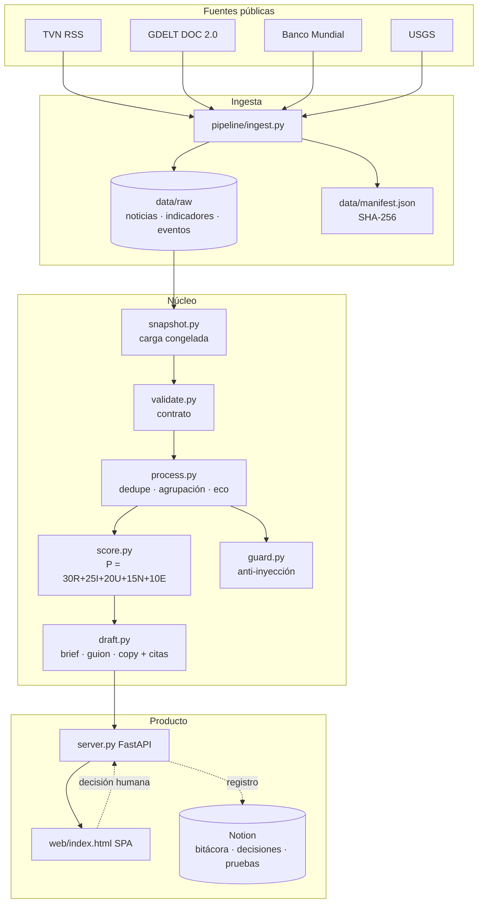
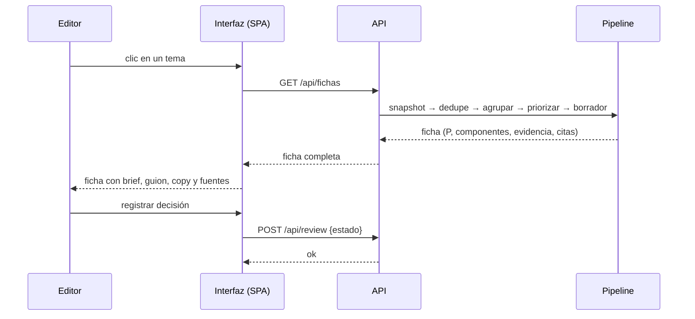
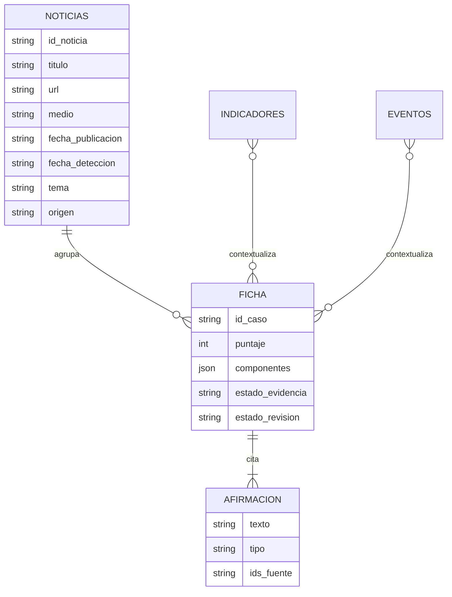
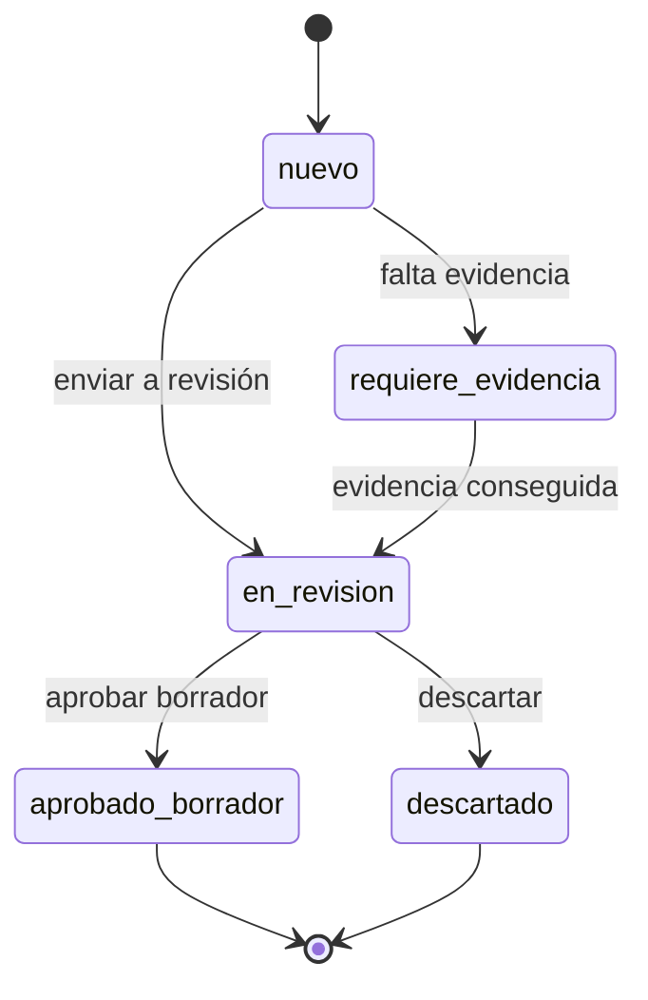

# Arquitectura — Panorama

Copiloto editorial para **TVN Media**. Snapshot público → pipeline determinista → mesa de prioridades → decisión humana.

## Arquitectura técnica

## Secuencia — abrir un tema

## Modelo de datos

## Estados de revisión (control humano)

> **Aprobar un borrador no significa publicar.**

## Componentes del pipeline

| Módulo | Responsabilidad |
|---|---|
| `ingest.py` | Construye el snapshot público (noticias, indicadores, eventos) + `manifest` |
| `snapshot.py` | Carga el snapshot congelado (demo reproducible, sin red) |
| `sources.py` | Fuentes en vivo — *fallback* documentado |
| `validate.py` | Contrato de datos: separa errores y conserva nulos |
| `process.py` | Dedupe, agrupación de eventos, **detección de eco**, verificación |
| `score.py` | Motor explicable `P = 30R+25I+20U+15N+10E` + estado de evidencia |
| `draft.py` | Paquete editorial con **citas por afirmación** y abstención |
| `guard.py` | Anti-inyección: el texto de una fuente es **dato, no instrucción** |
| `server.py` | API + interfaz (FastAPI) |

## Reproducibilidad

- **Snapshot congelado** en `data/raw/` con `manifest.json` (versión, corte UTC, consultas, licencias, **SHA-256**).
- Regenerar: `python -m pipeline.ingest`.
- Demo **sin internet** (T10) garantizada por el snapshot local.
- Evaluación reproducible: `python -m eval.acceptance` y `python -m eval.benchmark`.
